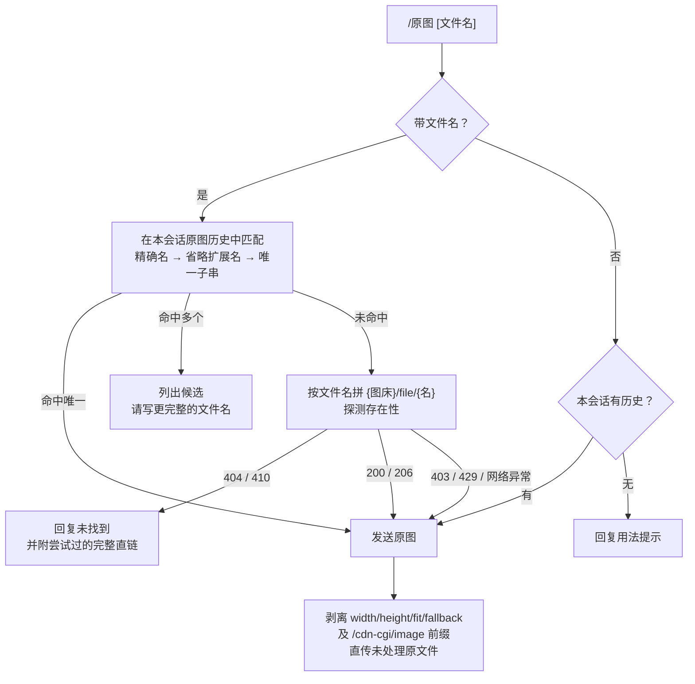

<div align="center">

# CloudFlare ImgBed 随机图 · AstrBot Plugin

**一条命令，从图床随机取图；要原图，随时 `/原图` 找回。**

[](./CHANGELOG.md)
[](https://github.com/AstrBotDevs/AstrBot)
[](https://www.python.org/)
[](./LICENSE)
[](https://github.com/diyushuang/astrbot_plugin_cloudflare_imgbed_random/stargazers)
[](https://github.com/diyushuang/astrbot_plugin_cloudflare_imgbed_random/issues)

<sub>服务端等比缩放 · OneBot 原生 URL 直传 · 本地压缩兜底 · 会话级原图找回 · LLM 工具调用</sub>

_An AstrBot plugin that fetches random images or videos from your CloudFlare ImgBed, with three delivery modes and per-session original-image recovery._

[功能特性](#功能特性) · [快速开始](#快速开始) · [安装](#安装) · [指令](#指令) · [配置项](#配置项) · [发送模式](#发送模式) · [常见问题](#常见问题) · [更新日志](./CHANGELOG.md)

</div>

---

> [!NOTE]
> 本插件聚焦一件事：**从 CloudFlare ImgBed 取随机图/视频并稳定发出**。不做图库管理、不做图片上传、不依赖除 `aiohttp` 与可选 `Pillow` 之外的任何第三方服务。

## 目录

| | | |
| --- | --- | --- |
| [功能特性](#功能特性) | [快速开始](#快速开始) | [安装](#安装) |
| [指令](#指令) | [配置项](#配置项) | [发送模式](#发送模式) |
| [从 v1 升级到 v2](#从-v1-升级到-v2) | [常见问题](#常见问题) | [项目结构](#项目结构) |
| [开发与测试](#开发与测试) | [参与贡献](#参与贡献) | [官方规范依据](#官方规范依据) |

## 功能特性

| 能力 | 说明 |
| --- | --- |
| 🎲 **随机取图** | `/随机图`、`/随机视频` 调用 ImgBed 随机接口取一条媒体并回传，支持指定目录 |
| 🖼️ **三种发送模式** | `scaled-url`（图床服务端缩放，默认）／`original-url`（直传原图）／`local-compress`（插件本地压缩） |
| ⚡ **OneBot 原生直传** | QQ `aiocqhttp` 平台绕开适配器的 base64 转换，直接下发图片 URL，由协议端自行下载并解析真实宽高 |
| 🗜️ **压缩兜底** | 服务端缩放不可用时自动降级本地 Pillow 压缩；AVIF/HEIC/SVG 等协议端无法解析宽高的格式强制转 JPEG |
| ↩️ **逐级回退** | 直传失败 → 本地字节回退 → 标准消息链，保证消息可达性 |
| 🔍 **`/原图` 找回** | 先查会话历史，未命中则按文件名到图床直查；剥离 ImgBed 处理参数还原未处理原文件 |
| 🧠 **LLM 工具** | 暴露 `sendRandomMedia`，可由 LLM 按自然语言触发随机图/视频 |
| 🪶 **零侵入** | 仅依赖 `aiohttp`（必需）与 `Pillow`（本地压缩可选），无外部服务、无后台任务 |

## 快速开始

1. 安装插件（见[安装](#安装)）；
2. 在插件配置中填写 `imgbed.domain`（你的 ImgBed 域名）；
3. 若使用默认的 `scaled-url`，先完成 ImgBed 后台的「图片尺寸处理」配置（见[前置要求](#前置要求)）；
4. 在群里发送 `/随机图` 试试；图不满意或想要原图时发送 `/原图`。

## 前置要求

- AstrBot `>=4.16,<5`
- 已部署并可访问的 CloudFlare ImgBed
- 已在 ImgBed 后台开启随机图 API，并开放目标目录
- 若使用 `scaled-url`：
  - 在 ImgBed 后台开启「图片尺寸处理」
  - 将 `{maxSide}x{maxSide}`（默认 `1920x1920`）或等价的 `auto` 组合加入允许尺寸；允许尺寸留空时表示允许任意合法尺寸
  - Cloudflare Pages 部署需绑定已接入 Cloudflare 的自定义域名，`pages.dev` 域名不支持 URL 图片转换
- 若使用 `local-compress`：
  - 安装 `Pillow`

## 安装

**方式一 · 从插件市场安装（推荐）**

AstrBot WebUI →「插件市场」→ 搜索 `CloudFlare ImgBed随机图` → 安装。

**方式二 · 从仓库安装**

WebUI →「插件管理」→ 从仓库安装，填入：

```text
https://github.com/diyushuang/astrbot_plugin_cloudflare_imgbed_random
```

**方式三 · 手动安装**

下载本仓库，将 `astrbot_plugin_cloudflare_imgbed_random` 目录放入 AstrBot 的 `data/plugins/` 下。

装好后：

1. AstrBot 会自动读取 `requirements.txt` 安装依赖；需手动安装时执行：
   ```bash
   pip install -r requirements.txt
   ```
2. 在 WebUI「插件管理」中重载插件；
3. 打开插件配置面板，填写 `imgbed.domain`。

> [!TIP]
> 只想要最简配置：填好 `imgbed.domain` 就能用。若图床未开启「图片尺寸处理」，把 `image.sendMode` 改为 `original-url`，插件会直接直传原图 URL，不做任何处理。

## 指令

| 指令 | 说明 |
| --- | --- |
| `/随机图 [目录]` | 随机取一张图片并回传；带目录时从该目录取图（如 `/随机图 img/wallpaper`） |
| `/随机视频 [目录]` | 随机取一个视频并回传 |
| `/原图 [文件名]` | 取原图：带文件名时按名到图床直查；不带文件名取本会话最近一张 |

`/随机图片`、`/随机影片` 也可被自然语言方式识别（如「来张随机图 风景」）。

### `/原图` 的找回顺序



关于「说不准」的那一档值得强调：**只有 HTTP 404 / 410 才判定「确定不存在」**。403（防盗链）、429（限流）、405（方法不允许）以及任何网络异常，都只能说明「这次没读到」，代表不了资源不存在——此时插件照常把直链发出去，不会误报找不到。

> [!NOTE]
> 历史记录同时保留 URL 文件名与消息中显示的文件名两个键，指向同一原图；因此你直接复制群消息里看到的文件名来 `/原图` 也能命中。
>
> 文件名直查要求已配置 `imgbed.domain`，且文件名需落在图床 `/file/` 目录下（可带子目录，如 `/原图 2026/09/abc.jpg`）。出于安全考虑，绝对 URL、`..`、`//`、反斜杠等输入会被拒绝。

## 配置项

> [!NOTE]
> `imgbed.apiToken` 在配置面板中已标记为敏感字段（`secret`），会以遮罩形式显示。

### `imgbed` — 图床连接

| 配置 | 类型 | 默认 | 说明 |
| --- | --- | --- | --- |
| `domain` | `string` | `""` | **【必填】** CloudFlare ImgBed 域名，例如 `https://your-domain` |
| `apiEndpoint` | `string` | `"/random"` | 随机图 API 路径，例如 `/random` 或 `/api/random.html` |
| `apiToken` | `string` | `""` | API Token（可选），填完整 `Authorization` 头值，例如 `Bearer YOUR_API_TOKEN`；配置 Token 时 `domain` 必须为 HTTPS |
| `defaultDir` | `string` | `""` | 默认目录（可选），相对路径，例如 `img/wallpaper` |
| `timeout` | `float` | `10` | API 请求超时时间（秒），最小 `0.1` |
| `retryCount` | `int` | `3` | API 请求失败后的重试次数，最小 `0`；采用指数退避 |

### `message` — 消息输出

| 配置 | 类型 | 默认 | 说明 |
| --- | --- | --- | --- |
| `showFileInfo` | `bool` | `true` | 是否在消息中附带文件名 |
| `enableLLM` | `bool` | `true` | 是否允许 LLM 工具调用；关闭后只能通过命令触发 |

### `image` — 图片发送

| 配置 | 类型 | 默认 | 说明 |
| --- | --- | --- | --- |
| `sendMode` | `string` | `"scaled-url"` | 图片发送模式，可选 `scaled-url` / `original-url` / `local-compress` |
| `enableProcessing` | `bool` | `true` | 关闭后 `scaled-url` 直传原 URL，不做服务端缩放 |
| `maxSide` | `int` | `1920` | 图片最长边（像素），范围 `1`–`4096` |
| `quality` | `int` | `85` | 本地 JPEG 压缩质量，范围 `1`–`100`；**仅 `local-compress` 使用** |

## 发送模式

| 模式 | 处理位置 | 说明 |
| --- | --- | --- |
| `scaled-url` | CloudFlare ImgBed 服务端 | 默认。追加 `?width={maxSide}&height={maxSide}&fallback=original`；失败后回退原 URL |
| `original-url` | 无 | 直接发送原图 URL，速度最快，但可能占用更多带宽 |
| `local-compress` | 插件本地 | 下载原图后经 Pillow 等比缩放并重编码为 JPEG |

<details>
<summary><b>为什么 <code>scaled-url</code> 不附加 <code>fit</code> 和 <code>quality</code>？（点击展开）</b></summary>

**不附加 `fit`**：CloudFlare ImgBed 官方文档规定，同时设置 `width` 和 `height` 且不传 `fit` 时，二者是等比最大边界。因此 `width=1920&height=1920` 表示「最长边不超过 1920」，**不会拉伸、不会裁剪、不会放大**。

**不附加 `quality`**：CloudFlare ImgBed 读取 API 未提供 `quality` 参数，`image.quality` 仅用于 `local-compress`。

**`fallback=original` 的作用**：图片格式不支持、超出限制或处理失败时，图床原样返回原文件，保证消息不会因缩放失败而发送失败。

</details>

<details>
<summary><b>发送链路的回退顺序（点击展开）</b></summary>

1. **服务端缩放 URL 直传** — QQ 平台经 OneBot 原生接口下发 URL，由协议端自行下载，宽高解析正常；
2. **原 URL 直传** — 缩放 URL 被协议端拒绝（如 403）时，改用未修改的原图 URL 再试一次；
3. **本地字节回退** — 两次直传都失败时，插件下载图片并按当前模式处理为字节后发送；
4. **标准消息链** — 本地下载也失败时，回退为 AstrBot 标准消息链的 `Image.fromURL`。

非 `aiocqhttp` 平台直接走第 3、4 步的标准消息链，不受 OneBot 链路影响。

</details>

## 从 v1 升级到 v2

v2.0.0 对配置结构做了破坏性重构，旧配置**会自动迁移**，通常无需手动操作：

| 旧配置 | 新配置 |
| --- | --- |
| `imgbedDomain` / `apiEndpoint` / `apiToken` / `defaultDir` / `timeout` / `retryCount` | `imgbed.*` |
| `showFileInfo` / `enableLLM` | `message.*` |
| `enableCompress` / `compressMaxSide` / `compressQuality` | `image.enableProcessing` / `image.maxSide` / `image.quality` |
| `imageSendMode=url` + `enableCompress=true` | `image.sendMode=scaled-url` |
| `imageSendMode=url` + `enableCompress=false` | `image.sendMode=original-url` |
| `imageSendMode=compress` + `enableCompress=true` | `image.sendMode=local-compress` |
| `imageSendMode=compress` + `enableCompress=false` | `image.sendMode=original-url` |

迁移会保留未识别的配置项，并写回 AstrBot 插件配置文件且输出 `WARNING`。写回失败时会恢复配置对象中的旧结构、本次运行继续使用内存中的迁移结果，下次启动会再次尝试迁移。建议升级后检查插件配置面板，确认旧键已被移除、新结构已生效。

## 常见问题

<details>
<summary><b><code>scaled-url</code> 请求返回 403？</b></summary>

图床未开启图片处理能力。逐项检查：

- 确认 ImgBed 后台已开启「图片尺寸处理」；
- 确认允许尺寸包含当前 `image.maxSide` 对应组合，或保持留空以允许任意合法尺寸；
- Cloudflare Pages 部署需绑定已接入 Cloudflare 的自定义域名，`pages.dev` 不支持 URL 图片转换。

若图床确实无法开启，把 `image.sendMode` 改为 `original-url` 或 `local-compress` 即可绕开。

</details>

<details>
<summary><b>QQ 聊天气泡里的图片显示成 1:1？</b></summary>

QQ 气泡的显示比例由消息元数据中的宽高决定，解析失败会以 `1024x1024` 占位显示成 1:1。

插件已做的处理：

- 按 NapCat `OB11MessageImage` 规范，经 OneBot 原生接口直传 URL，由协议端自行下载并解析真实宽高（绕开适配器统一转 base64 的链路）；
- `scaled-url` 优先发送缩放 URL，失败后再试原 URL，最后进入本地字节回退；
- AVIF/HEIC/SVG 等协议端无法解析宽高的格式自动降级为本地压缩转 JPEG。

若仍显示 1:1，检查日志是否出现两次「OneBot 直传图片失败」——这表示缩放 URL 与原 URL 均被协议端拒绝，消息已进入最后的字节回退。可尝试升级 NapCat 到最新版本，或改用 `image.sendMode=original-url` 复测。

</details>

<details>
<summary><b><code>local-compress</code> 看起来没生效？</b></summary>

- 确认已安装 `Pillow`（未安装时插件会输出 `WARNING` 并自动禁用压缩）；
- 检查 `image.enableProcessing` 是否为开启状态；
- 检查日志中是否有下载、解码或压缩失败信息；
- 注意两种正常的「不压缩」情形：**动图**不做重编码以保留动画；**原图 ≤200KB 且格式可被协议端解析**时跳过重编码以避免画质损失。

</details>

<details>
<summary><b><code>/原图 文件名</code> 提示「图床里没有找到」？</b></summary>

插件按 `{imgbed.domain}/file/{文件名}` 拼接直链并探测。请确认：

- 文件名与图床里的实际文件名一致（含上传目录时写成 `/原图 2026/09/abc.jpg`）；
- 该文件确实位于图床的 `/file/` 路径下。

注意判定标准：只有 HTTP **404 / 410** 才判「确定不存在」；**403**（防盗链/访问规则）、**429**（限流）等只说明这次没读到，此时插件会照常把直链发出去。

若图床不是 CloudFlare ImgBed 或文件放在自定义目录，请先 `/随机图` 让图片进入会话历史，再用 `/原图` 找回。

</details>

<details>
<summary><b><code>/原图</code> 提示「本会话还没有发送过随机图片」？</b></summary>

`/原图` 不带参数时依赖本会话的图片历史（每个会话最多保留最近 30 张），且历史按会话隔离——换个群或换个人问，是查不到之前那个会话的历史的。

先用 `/随机图` 取一张图，之后 `/原图` 即可找回。或者直接带文件名让插件到图床直查：`/原图 文件名.jpg`。

</details>

<details>
<summary><b>LLM 工具无法调用？</b></summary>

- 确认 `message.enableLLM` 已开启；
- 确认 AstrBot 已启用 LLM 工具调用能力；
- 工具名为 `sendRandomMedia`，接受 `directory` 与 `content_type`（`image` / `video`）两个可选参数。

</details>

<details>
<summary><b>自然语言「来张随机图」能触发吗？</b></summary>

可以。插件同时支持命令式与自然语言式关键词识别（`随机视频` / `随机图片` / `随机图` / `随机影片`），并会尝试把关键词之后的内容解析为目录，例如「来张随机图 风景」等价于 `/随机图 风景`。

若 AstrBot 侧的 LLM 已启用工具调用，也可由 LLM 直接调用 `sendRandomMedia`。

</details>

## 项目结构

```text
astrbot_plugin_cloudflare_imgbed_random/
├── main.py                  # 插件全部实现（单文件）
├── _conf_schema.json        # AstrBot 配置面板 Schema（imgbed / message / image）
├── metadata.yaml            # 插件元信息（名称、版本、作者、支持的平台）
├── requirements.txt         # 运行依赖：aiohttp、Pillow
├── tests/test_main.py       # 单元测试（stub 掉 astrbot.*，无需安装 AstrBot）
├── ruff.toml                # 代码规范配置
└── .github/workflows/test.yml  # CI：单元测试 + 语法编译检查
```

插件保持**单文件**实现，不引入额外业务模块。`main.py` 内部按职责分段：配置加载与迁移 → URL 构造与校验 → 媒体类型识别 → 图片压缩 → OneBot 直传 → 统一发送入口 → 命令与 LLM 工具 → 会话历史与 `/原图`。

## 开发与测试

```bash
pip install -r requirements.txt
python -m unittest discover -s tests -v
```

代码规范检查：

```bash
ruff format --check .
ruff check .
```

测试通过 stub 替换 `astrbot.*` 模块，因此**无需安装 AstrBot** 即可运行。CI 在每次 push 与 PR 时于 Python 3.11 上执行单元测试与 `py_compile` 语法检查。

## 参与贡献

欢迎通过 [Issue](https://github.com/diyushuang/astrbot_plugin_cloudflare_imgbed_random/issues) 反馈问题，或提交 Pull Request：

- 提交前请确保 `ruff format --check .` 与 `ruff check .` 无告警、单元测试全部通过；
- 版本号需同步 `metadata.yaml` 的 `version`、`main.py` 中 `@register(...)` 的版本位与 `CHANGELOG.md`；
- 本项目聚焦图床随机图功能，**不新增业务模块、不引入额外依赖或配置项**；涉及启动速度、响应延迟与代码精简的取舍，请在 PR 中说明理由。

## 官方规范依据

- [AstrBot 插件配置规范](https://docs.astrbot.app/dev/star/guides/plugin-config.html)
- [AstrBot 消息发送规范](https://docs.astrbot.app/dev/star/guides/send-message.html)
- [AstrBot 平台适配器媒体处理规范](https://docs.astrbot.app/dev/plugin-platform-adapter.html)
- [NapCat `send_group_msg` / `send_private_msg` 接口文档](https://napcat.apifox.cn/226656598e0)
- [NapCat `OB11MessageImage` 消息段文档](https://napcat.apifox.cn/246111200d0)
- [CloudFlare ImgBed 随机图 API 文档](https://cfbed.sanyue.de/api/random.html)
- [CloudFlare ImgBed 读取 API 文档](https://cfbed.sanyue.de/api/file.html)
- [CloudFlare ImgBed 配置说明](https://cfbed.sanyue.de/deployment/configuration.html)

## 致谢

- [AstrBot](https://github.com/AstrBotDevs/AstrBot) — 易于扩展的多平台 LLM 聊天机器人框架；
- [CloudFlare-ImgBed](https://github.com/MarSeventh/CloudFlare-ImgBed) — 本插件对接的图床服务。

## 许可证

本项目基于 [MIT](./LICENSE) 许可证发布。
